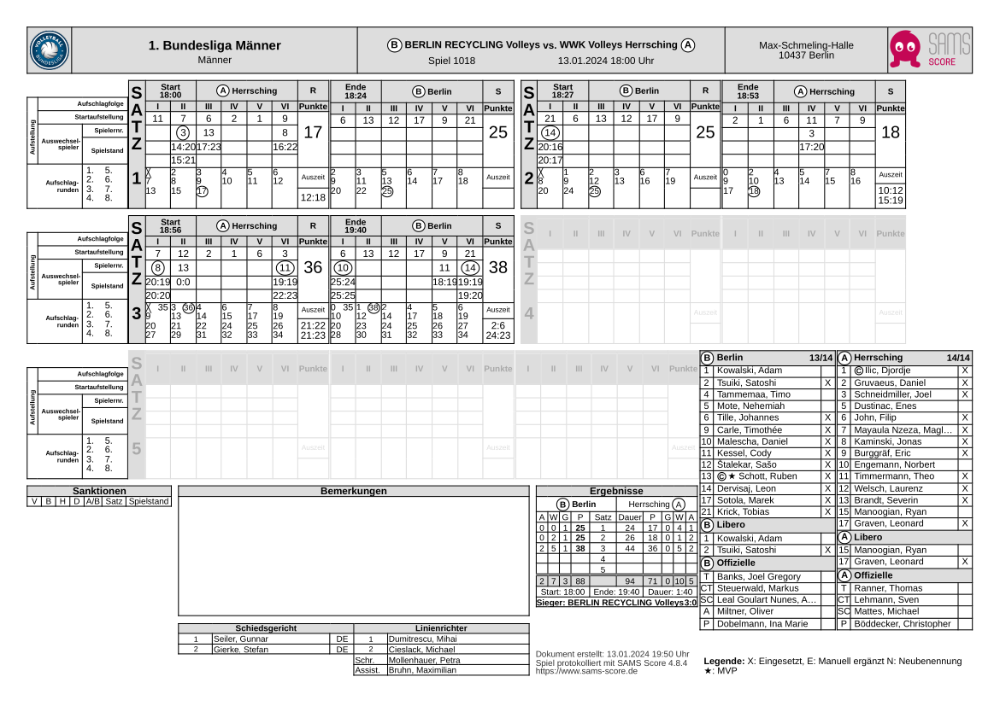
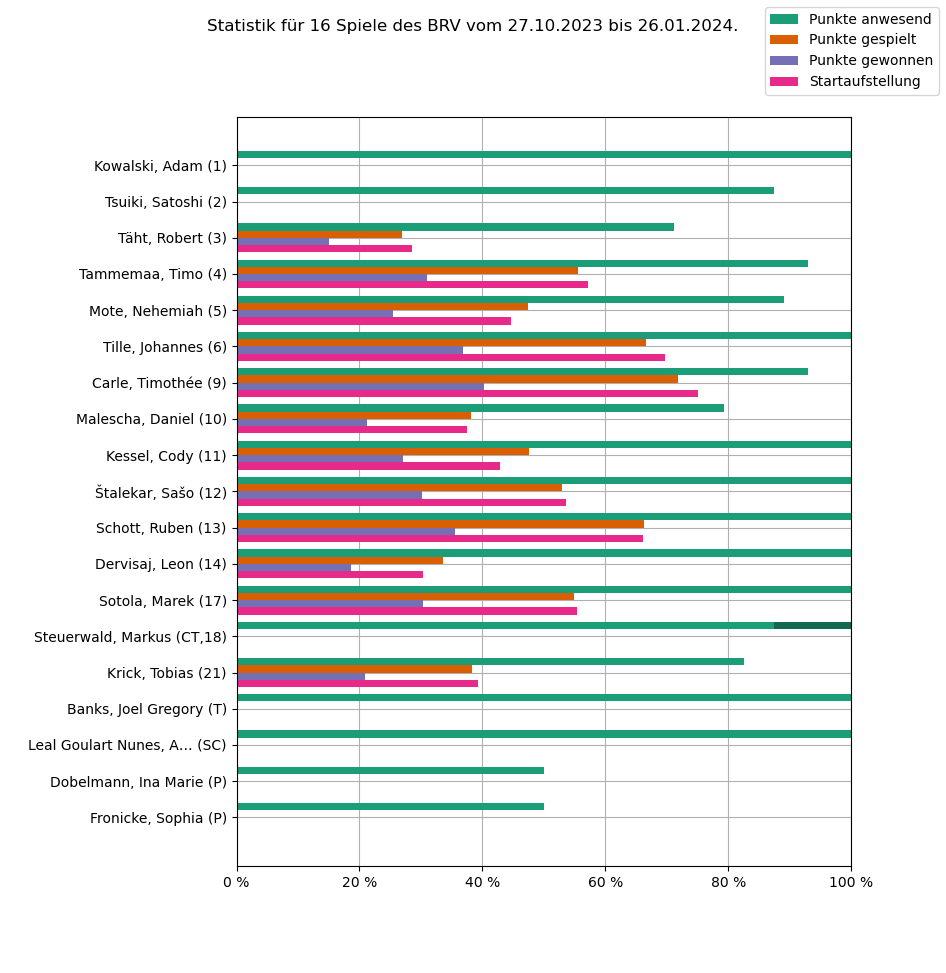

# SCORESHEETS
Automatically read DVV Volleyball scoresheets and extract player statistics.

## Features
- Read player information (including liberos and officials), starting rotation and substitutions from score sheet.
- Compile list of player statistics including:
    - Number of points played by each person in each match.
    - Number of points present for each person in each match.
    - Number of sets in starting rotation for each peron in each match.
- Plot statistics.



<!---->
<!---->

## Getting started

### Prequisites
In order to run the package you need [`pdftotext`](https://www.xpdfreader.com/pdftotext-man.html).

### Setup
Clone this repository to your desired folder:

```
  cd my-folder
  git clone git@github.com:myaccount/my-project.git
```

### Usage
1. Change the `path`, `team_name` and `team_name_regex` variables in `main.py`. 
    - `path`: Path to a directory with the scoresheets as pdf files.
    - `team_name`: A short name (acronym) of the team. The name can be arbitrary.
    - `team_name_regex`: A regular expression string that is used to find instances of the team name in the score sheet. The name must match the one given in the score sheet.
2. Create directories for files and figures.

    ```
        mkdir files; mkdir figures
    ```

2. Run 

    ```
    python3 main.py
    ```

     to read all pdf files in the directory given above. This saves a file containing the player statistics to `./files/`.

3. Run 

    ```
    python3 plot_stats.py <team_name>
    ```

    to read the statistics file just created and plot the result.

## Authors

**Ben Strassberger**

- GitLab:[@bstrass](https://gitlab.com/bstrass/)

## Contributing

## License
