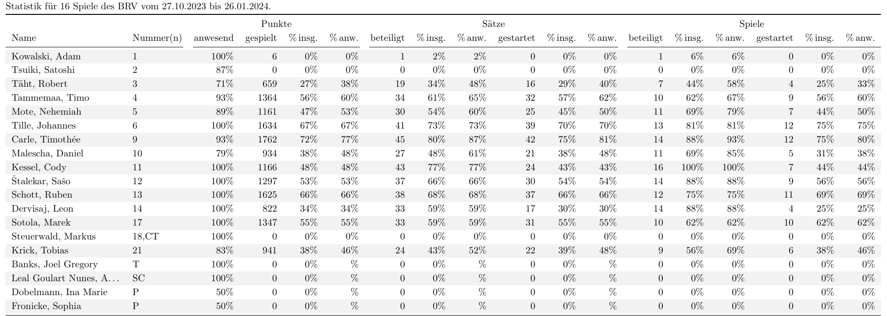

# SCORESHEETS
Automatically read DVV Volleyball scoresheets and extract player statistics.

## Features
- Read player information (including liberos and officials), starting rotation and substitutions from score sheet.
- Compile list of player statistics including:
    - Number of points present for each person in each match.
    - Number of points played by each person in each match.
    - Number of sets in starting rotation for each peron in each match.
- Export table of player statistics.
- Plot statistics.



<!---->
<!---->

## Getting started

### Prequisites
In order to run the package you need [`pdftotext`](https://www.xpdfreader.com/pdftotext-man.html).

### Setup
Clone this repository to your desired folder:

```
  cd my-folder
  git clone git@github.com:myaccount/my-project.git
```

### Usage
1. Download score sheets into the `./scoresheets/<team_name>/` directory. `team_name` can be anything and must be passed later.

2. Run 

    ```
    python3 new_statistics.py <team_name> <team_name_regex>
    ```

    to read all pdf files in the directory given above. This saves a file containing the player statistics to `./files/statistics_<team_name>.dat`.

    - `team_name` can be anything
    - `team_name_regex` must be a regular expression string that matches the team name (or part of it) given in the title of the score sheet **AND** the title of the player list.
    
    Example:

    ```
    python3 new_statistics.py BRV 'BERLIN RECYCLING|Berlin'
    ```

3. (optional) Run

    ```
    python3 add_scoresheet2stats.py <team_name> <path/to/scoresheet.pdf>
    ```

    to add additional score sheets to  `./files/statistics_<team_name>.dat` created previously.

4. Run 

    ```
    python3 plot_stats.py <team_name>
    ```

    to read the statistics file created previously and export a table and plot of the result.

## Authors

**Ben Strassberger**

- GitLab:[@bstrass](https://gitlab.com/bstrass/)

## Contributing

## License
